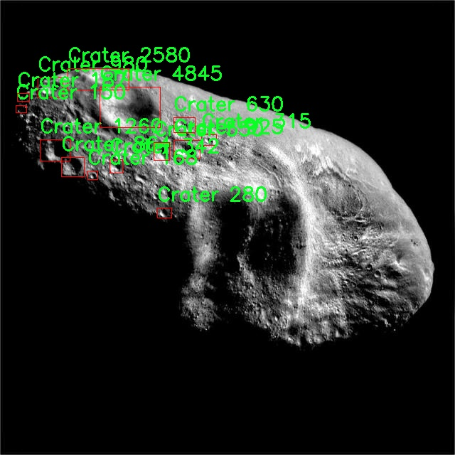

# 月球陨石坑检测系统源码分享
 # [一条龙教学YOLOV8标注好的数据集一键训练_70+全套改进创新点发刊_Web前端展示]

### 1.研究背景与意义

项目参考[AAAI Association for the Advancement of Artificial Intelligence](https://gitee.com/qunmasj/projects)

项目来源[AACV Association for the Advancement of Computer Vision](https://kdocs.cn/l/cszuIiCKVNis)

研究背景与意义

随着人类对月球探索的深入，月球表面的特征和变化成为了科学研究的重要内容。月球陨石坑的形成与演化不仅能够揭示月球的地质历史，还为理解太阳系其他天体的演化提供了重要线索。陨石坑的数量、分布及其形态特征是研究月球表面环境和历史的重要指标。因此，开发高效、准确的月球陨石坑检测系统，能够为月球地质研究、资源勘探以及未来的载人航天任务提供强有力的支持。

在这一背景下，计算机视觉技术的迅猛发展为月球陨石坑的自动检测提供了新的机遇。YOLO（You Only Look Once）系列算法以其快速的检测速度和较高的准确率，已成为目标检测领域的热门选择。YOLOv8作为该系列的最新版本，结合了深度学习的最新进展，具备了更强的特征提取能力和更高的检测精度。然而，针对特定领域如月球陨石坑的检测，现有的YOLOv8模型仍需进行改进，以适应特定的应用场景和数据特征。

本研究的核心在于基于改进的YOLOv8模型，构建一个高效的月球陨石坑检测系统。我们将利用一个包含579幅图像的专用数据集，该数据集涵盖了6个类别的陨石坑，具体包括不同类型的陨石坑（如Crater 1至Crater 4）。这些图像不仅提供了丰富的视觉信息，还涵盖了不同的光照条件和视角变化，为模型的训练和测试提供了良好的基础。通过对这些数据的深入分析，我们能够识别出陨石坑的特征，并优化YOLOv8模型的参数设置，以提高其在特定任务中的表现。

改进YOLOv8模型的意义不仅在于提升检测精度，更在于推动月球探测技术的发展。通过自动化的陨石坑检测，科学家们可以更快速地获取月球表面的信息，从而加速地质研究的进程。此外，随着未来探月任务的增多，准确的陨石坑检测系统将为月球基地的选址、资源的开发和环境的监测提供重要支持。

综上所述，基于改进YOLOv8的月球陨石坑检测系统的研究，不仅具有重要的科学价值，也为实际应用提供了新的技术手段。通过本研究，我们希望能够推动月球探测领域的技术进步，为人类探索宇宙的梦想贡献一份力量。

### 2.图片演示


##### 注意：由于此博客编辑较早，上面“2.图片演示”和“3.视频演示”展示的系统图片或者视频可能为老版本，新版本在老版本的基础上升级如下：（实际效果以升级的新版本为准）

  （1）适配了YOLOV8的“目标检测”模型和“实例分割”模型，通过加载相应的权重（.pt）文件即可自适应加载模型。

  （2）支持“图片识别”、“视频识别”、“摄像头实时识别”三种识别模式。

  （3）支持“图片识别”、“视频识别”、“摄像头实时识别”三种识别结果保存导出，解决手动导出（容易卡顿出现爆内存）存在的问题，识别完自动保存结果并导出到tempDir中。

  （4）支持Web前端系统中的标题、背景图等自定义修改，后面提供修改教程。

  另外本项目提供训练的数据集和训练教程,暂不提供权重文件（best.pt）,需要您按照教程进行训练后实现图片演示和Web前端界面演示的效果。

### 3.视频演示

[3.1 视频演示](https://www.bilibili.com/video/BV1uL2gYiEps/)

### 4.数据集信息展示

##### 4.1 本项目数据集详细数据（类别数＆类别名）

nc: 1
names: ['Crater']


##### 4.2 本项目数据集信息介绍

数据集信息展示

在本研究中，我们采用了名为“craters”的数据集，以支持对YOLOv8模型的改进，专注于月球陨石坑的检测任务。该数据集的设计旨在提供高质量的标注数据，帮助研究人员和开发者在月球表面特征识别方面取得更好的效果。数据集的核心类别为“Crater”，这表明我们专注于识别和定位月球表面上存在的陨石坑。陨石坑是月球表面特征的重要组成部分，其形成过程和分布特征对于理解月球的地质历史具有重要意义。

“craters”数据集包含了大量的高分辨率月球图像，这些图像经过精心挑选和标注，确保了数据的多样性和代表性。每个图像中，陨石坑的边界被准确地标注出来，形成了一个清晰的训练样本。这种标注方式不仅有助于模型的训练，也为后续的验证和测试提供了可靠的基准。通过对这些图像的分析，YOLOv8模型能够学习到陨石坑的形状、大小、深度以及在不同光照条件下的表现，从而提高其检测精度。

在数据集的构建过程中，研究团队特别关注了数据的均衡性和多样性。虽然数据集中只有一个类别“Crater”，但为了确保模型的泛化能力，数据集涵盖了不同类型的陨石坑，包括大型陨石坑、小型陨石坑、以及不同地质年代形成的陨石坑。这种多样性使得模型能够在面对不同特征的陨石坑时，依然保持较高的检测性能。此外，数据集中还包含了不同视角和不同分辨率的图像，这为模型提供了丰富的学习素材，帮助其适应各种实际应用场景。

在数据集的使用过程中，我们还进行了数据增强，以进一步提升模型的鲁棒性。通过旋转、缩放、翻转等方式，生成了更多的训练样本。这些增强技术不仅增加了数据集的规模，还帮助模型在训练过程中学习到更为复杂的特征，提高了其对陨石坑的检测能力。经过这些处理后，数据集的有效性和实用性得到了显著提升，为后续的模型训练奠定了坚实的基础。

总之，“craters”数据集为改进YOLOv8的月球陨石坑检测系统提供了丰富而高质量的训练数据。通过对该数据集的深入分析和应用，我们期望能够显著提升模型在陨石坑检测任务中的表现，为月球探测和研究提供更为精准的技术支持。随着研究的深入，我们相信这一数据集将为未来的科学探索和技术创新提供宝贵的参考和借鉴。





### 5.全套项目环境部署视频教程（零基础手把手教学）

[5.1 环境部署教程链接（零基础手把手教学）](https://www.ixigua.com/7404473917358506534?logTag=c807d0cbc21c0ef59de5)


[5.2 安装Python虚拟环境创建和依赖库安装视频教程链接（零基础手把手教学）](https://www.ixigua.com/7404474678003106304?logTag=1f1041108cd1f708b01a)

### 6.手把手YOLOV8训练视频教程（零基础小白有手就能学会）

[6.1 手把手YOLOV8训练视频教程（零基础小白有手就能学会）](https://www.ixigua.com/7404477157818401292?logTag=d31a2dfd1983c9668658)


按照上面的训练视频教程链接加载项目提供的数据集，运行train.py即可开始训练



     Epoch   gpu_mem       box       obj       cls    labels  img_size
     1/200     20.8G   0.01576   0.01955  0.007536        22      1280: 100%|██████████| 849/849 [14:42<00:00,  1.04s/it]
               Class     Images     Labels          P          R     mAP@.5 mAP@.5:.95: 100%|██████████| 213/213 [01:14<00:00,  2.87it/s]
                 all       3395      17314      0.994      0.957      0.0957      0.0843

     Epoch   gpu_mem       box       obj       cls    labels  img_size
     2/200     20.8G   0.01578   0.01923  0.007006        22      1280: 100%|██████████| 849/849 [14:44<00:00,  1.04s/it]
               Class     Images     Labels          P          R     mAP@.5 mAP@.5:.95: 100%|██████████| 213/213 [01:12<00:00,  2.95it/s]
                 all       3395      17314      0.996      0.956      0.0957      0.0845

     Epoch   gpu_mem       box       obj       cls    labels  img_size
     3/200     20.8G   0.01561    0.0191  0.006895        27      1280: 100%|██████████| 849/849 [10:56<00:00,  1.29it/s]
               Class     Images     Labels          P          R     mAP@.5 mAP@.5:.95: 100%|███████   | 187/213 [00:52<00:00,  4.04it/s]
                 all       3395      17314      0.996      0.957      0.0957      0.0845


### 7.70+种全套YOLOV8创新点代码加载调参视频教程（一键加载写好的改进模型的配置文件）

[7.1 70+种全套YOLOV8创新点代码加载调参视频教程（一键加载写好的改进模型的配置文件）](https://www.ixigua.com/7404478314661806627?logTag=29066f8288e3f4eea3a4)

### 8.70+种全套YOLOV8创新点原理讲解（非科班也可以轻松写刊发刊，V10版本正在科研待更新）

#### 由于篇幅限制，每个创新点的具体原理讲解就不一一展开，具体见下列网址中的创新点对应子项目的技术原理博客网址【Blog】：


[8.1 70+种全套YOLOV8创新点原理讲解链接](https://gitee.com/qunmasj/good)

#### 部分改进原理讲解(完整的改进原理见上图和技术博客链接)【如果此小节的图加载失败可以通过CSDN或者Github搜索该博客的标题访问原始博客，原始博客图片显示正常】
### YOLOv8简介
YOLOv8目标检测算法继承了YOLOv1系列的思考,是一种新型端到端的目标检测算法,尽管现在原始检测算法已经开源,但是鲜有发表的相关论文.YOLOv8的网络结构如图所示,主要可分为Input输入端、Backbone骨干神经网络、Neck 混合特征网络层和Head预测层网络共4个部分.

YOLO目标检测算法是一种端到端的One-Slage 目标检测算法，其核心思想是将图像按区域分块进行预测。YOLO将输入图像按照32x32的大小划分成若干个网格，例如416x416的图像将被划分为13x13个网格。当目标物体的中心位于某个网格内时,该网格就会负责输出该物体的边界框和类别置信度。每个网格可以预测多个边界框和多个目标类别,这些边界框和类别的数量可以根据需要进行设置。YOLO算法的输出是一个特征图,包含了每个网格对应的边界框和类别置信度的信息呵。本文采用YOLO最新的YOLOv8模型，其是2022年底发布的最新YOLO系列模型，采用全新的SOTA模型，全新的网络主干结构,如图1所示。
整个网络分为Backbone 骨干网络部分和Head头部网络部分。YOLOv8汲取了前几代网络的优秀特性，骨干网络和 Neck部分遵循CSP的思想，将YOLOv5中的C3模块被替换成了梯度流更丰富C2模块,去掉YOLOv5中 PAN-FPN上采样阶段中的卷积结构,将Backbone不同阶段输出的特征直接送入了上采样操作,模型提供了N/S/M/L/X尺度的不同大小模型,能够满足不同领域业界的需求。本文基于YOLOv8模型设计番茄病虫害检测系统，通过配置模型参数训练番茄图像,得到能够用于部署应用的最优模型。


### 感受野注意力卷积（RFAConv)
#### 标准卷积操作回顾
标准的卷积操作是构造卷积神经网络的基本构件。它利用具有共享参数的滑动窗口提取特征信息，克服了全连通层构造神经网络固有的参数多、计算开销大的问题。设 X R∈C×H×W
表示输入特征图，其中C、H、W分别表示特征图的通道数、高度、宽度。为了清楚地演示卷积核的特征提取过程，我们使用 C = 1 的例子。从每个接受域滑块中提取特征信息的卷积运算可以表示为:


这里，Fi 表示计算后每个卷积滑块得到的值，Xi 表示每个滑块内对应位置的像素值，K表示卷积核，S表示卷积核中的参数个数，N表示接收域滑块的总数。可以看出，每个滑块内相同位置的 feature共享相同的参数Ki。因此，标准的卷积运算并不能捕捉到不同位置所带来的信息差异，这最终在一定程度上限制了卷积神经网络的性能。 

#### 空间注意力回顾
目前，空间注意机制是利用学习得到的注意图来突出每个特征的重要性。与前一节类似，这里以 C=1为例。突出关键特征的空间注意机制可以简单表述为:这里，Fi 表示加权运算后得到的值。xi 和Ai 表示输入特征图和学习到的注意图在不同位置的值，N为输入特征图的高和宽的乘积，表示像素值的总数。


#### 空间注意与标准卷积运算
将注意力机制整合到卷积神经网络中，可以提高卷积神经网络的性能。通过对标准卷积运算和现有空间注意机制的研究，我们认为空间注意机制有效地克服了卷积神经网络固有的参数共享的局限性。目前卷积神经网络中最常用的核大小是 1 × 1和3 × 3。在引入空间注意机制后，提取特征的卷积操作可以是 1 × 1或3 × 3卷积操作。为了直观地展示这个过程，在 1 × 1卷积运算的前面插入了空间注意机制。通过注意图对输入特征图(Re-weight“×”)进行加权运算，最后通过 1 × 1卷积运算提取接收域的滑块特征信息。整个过程可以简单地表示如下:


 这里卷积核K仅代表一个参数值。如果取A i× ki 的值作为一种新的卷积核参数，有趣的是它解决了 1×1卷积运算提取特征时的参数共享问题。然而，关于空间注意机制的传说到此结束。当空间注意机制被插入到3×3卷积运算前面时。具体情况如下:


如上所述，如果取A的值 i × ki (4)式作为一种新的卷积核参数，完全解决了大规模卷积核的参数共享问题。然而，最重要的一点是，卷积核在提取每个接受域滑块的特征时，会共享一些特征。换句话说，每个接收域滑块内都有一个重叠。仔细分析后会发现A12= a21， a13 = a22， a15 = a24……，在这种情况下，每个滑动窗口共享空间注意力地图的权重。因此，空间注意机制没有考虑整个接受域的空间特征，不能有效地解决大规模卷积核的参数共享问题。因此，空间注意机制的有效性受到限制。 

#### 创新空间注意力和标准卷积操作
该博客提出解决了现有空间注意机制的局限性，为空间处理提供了一种创新的解决方案。受RFA的启发，一系列空间注意机制被开发出来，可以进一步提高卷积神经网络的性能。RFA可以看作是一个轻量级即插即用模块，RFA设计的卷积运算(RFAConv)可以代替标准卷积来提高卷积神经网络的性能。因此，我们预测空间注意机制与标准卷积运算的结合将继续发展，并在未来带来新的突破。
接受域空间特征:为了更好地理解接受域空间特征的概念，我们将提供相关的定义。接收域空间特征是专门为卷积核设计的，并根据核大小动态生成。如图1所示，以3×3卷积核为例。在图1中，“Spatial Feature”指的是原始的Feature map。“接受域空间特征”是空间特征变换后的特征图。

 

由不重叠的滑动窗口组成。当使用 3×3卷积内核提取特征时，接收域空间特征中的每个 3×3大小窗口代表一个接收域滑块。接受域注意卷积(RFAConv):针对接受域的空间特征，我们提出了接受域注意卷积(RFA)。该方法不仅强调了接收域滑块内不同特征的重要性，而且对接收域空间特征进行了优先排序。通过该方法，完全解决了卷积核参数共享的问题。接受域空间特征是根据卷积核的大小动态生成的，因此，RFA是卷积的固定组合，不能与卷积操作的帮助分离，卷积操作同时依赖于RFA来提高性能，因此我们提出了接受场注意卷积(RFAConv)。具有3×3大小的卷积核的RFAConv整体结构如图所示。


目前，最广泛使用的接受域特征提取方法是缓慢的。经过大量的研究，我们开发了一种快速的方法，用分组卷积来代替原来的方法。具体来说，我们利用相应大小的分组卷积来动态生成基于接受域大小的展开特征。尽管与原始的无参数方法(如PyTorch提供的nn.())相比，该方法增加了一些参数，但它的速度要快得多。注意:如前一节所述，当使用 3×3卷积内核提取特征时，接收域空间特征中的每个 3×3大小窗口表示一个接收域滑块。而利用快速分组卷积提取感受野特征后，将原始特征映射为新的特征。最近的研究表明。交互信息可以提高网络性能，如[40,41,42]所示。同样，对于RFAConv来说，通过交互接受域特征信息来学习注意图可以提高网络性能。然而，与每个接收域特征交互会导致额外的计算开销，因此为了最小化计算开销和参数的数量，我们使用AvgPool来聚合每个接收域特征的全局信息。然后，使用 1×1 组卷积操作进行信息交互。最后，我们使用softmax来强调每个特征在接受域特征中的重要性。一般情况下，RFA的计算可以表示为:


这里gi×i 表示一个大小为 i×i的分组卷积，k表示卷积核的大小，Norm表示归一化，X表示输入的特征图，F由注意图 a相乘得到 rf 与转换后的接受域空间特征 Frf。与CBAM和CA不同，RFA能够为每个接受域特征生成注意图。卷积神经网络的性能受到标准卷积操作的限制，因为卷积操作依赖于共享参数，对位置变化带来的信息差异不敏感。然而，RFAConv通过强调接收域滑块中不同特征的重要性，并对接收域空间特征进行优先级排序，可以完全解决这个问题。通过RFA得到的feature map是接受域空间特征，在“Adjust Shape”后没有重叠。因此，学习到的注意图将每个接受域滑块的特征信息聚合起来。换句话说，注意力地图不再共享在每个接受域滑块。这完全弥补了现有 CA和CBAM注意机制的不足。RFA为标准卷积内核提供了显著的好处。而在调整形状后，特征的高度和宽度是 k倍，需要进行 stride = k的k × k卷积运算来提取特征信息。RFA设计的卷积运算RFAConv为卷积带来了良好的增益，对标准卷积进行了创新。
此外，我们认为现有的空间注意机制应该优先考虑接受域空间特征，以提高网络性能。众所周知，基于自注意机制的网络模型[43,44,45]取得了很大的成功，因为它解决了卷积参数共享的问题，并对远程信息进行建模。然而，自注意机制也为模型引入了显著的计算开销和复杂性。我们认为，将现有的空间注意机制的注意力引导到接受场空间特征上，可以以类似于自我注意的方式解决长期信息的参数共享和建模问题。与自我关注相比，这种方法需要的参数和计算资源少得多。答案如下:(1)将以接收场空间特征为中心的空间注意机制与卷积相结合，消除了卷积参数共享的问题。(2)现有的空间注意机制已经考虑了远程信息，可以通过全局平均池或全局最大池的方式获取全局信息，其中明确考虑了远程信息。因此，我们设计了新的 CBAM和CA模型，称为RFCBAM和RFCA，它们专注于接受域空间特征。与RFA类似，使用最终的k × k stride = k 的卷积运算来提取特征信息。这两种新的卷积方法的具体结构如图 3所示，我们称这两种新的卷积操作为 RFCBAMConv和RFCAConv。与原来的CBAM相比，我们在RFCBAM中使用SE attention来代替CAM。因为这样可以减少计算开销。此外，在RFCBAM中，通道注意和空间注意不是分开执行的。相反，它们是同时加权的，使得每个通道获得的注意力地图是不同的。


### 9.系统功能展示（检测对象为举例，实际内容以本项目数据集为准）

图9.1.系统支持检测结果表格显示

  图9.2.系统支持置信度和IOU阈值手动调节

  图9.3.系统支持自定义加载权重文件best.pt(需要你通过步骤5中训练获得)

  图9.4.系统支持摄像头实时识别

  图9.5.系统支持图片识别

  图9.6.系统支持视频识别

  图9.7.系统支持识别结果文件自动保存

  图9.8.系统支持Excel导出检测结果数据


### 10.原始YOLOV8算法原理

原始YOLOv8算法原理

YOLOv8作为YOLO系列的最新版本，继承了前几代模型的设计理念，同时在多个方面进行了显著的改进，以提高目标检测的性能和效率。YOLOv8的核心在于其独特的网络结构和数据处理方法，使其在复杂环境下仍能保持高效的检测能力。与以往的YOLO版本相比，YOLOv8采用了anchor-free的检测方式，这一创新使得模型在处理不同尺度和形状的目标时，能够更灵活地适应变化，从而提升了检测精度和速度。

在YOLOv8的设计中，输入端首先对图像进行一系列的数据增强处理。这些处理包括马赛克增强、混合增强、空间扰动和颜色扰动等，旨在通过丰富训练数据的多样性来提高模型的泛化能力。通过这些增强手段，YOLOv8能够更好地适应不同的环境和背景，从而在实际应用中表现出色。

YOLOv8的主干网络结构在继承YOLOv5的基础上进行了优化，采用了新的C2f模块来替代原有的C3模块。C2f模块的设计理念是通过引入更多的分支来丰富梯度回传过程中的信息流动，从而提高特征提取的效率和效果。这种设计不仅增强了网络对特征的提取能力，还有效地减轻了在下采样过程中可能出现的噪声影响。

在特征融合方面，YOLOv8依然采用了FPN（Feature Pyramid Network）和PAN（Path Aggregation Network）的结合结构。这一结构能够充分利用多尺度特征之间的信息，通过上采样和下采样的方式实现特征的有效融合。这种融合策略使得YOLOv8在处理不同大小的目标时，能够更好地保持特征的完整性，从而提升检测的准确性。

YOLOv8的输出端采用了解耦头结构，这一设计的核心在于将分类和定位任务分开处理。通过使用两条并行的分支，YOLOv8能够分别提取类别特征和位置特征，进而通过1×1卷积实现分类和定位的解耦。这种解耦的方式不仅提高了模型的灵活性，还使得模型在处理复杂场景时能够更精准地识别目标。

在标签分配策略上，YOLOv8引入了TOOD（Task-Oriented Object Detection）策略，避免了传统的候选框聚类方法带来的局限性。TOOD策略通过动态标签分配的方式，确保正负样本的匹配更加合理。YOLOv8的损失函数设计也体现了这一思想，分类损失采用了变焦损失（Varifocal Loss），而回归损失则结合了CIoU（Complete Intersection over Union）和DFL（Distribution Focal Loss）两种损失函数。这种设计使得模型在训练过程中能够更好地关注高质量的正样本，同时有效降低负样本对损失的影响，从而提升了模型的整体性能。

尽管YOLOv8在多个方面进行了优化，但在复杂水面环境下，仍然面临着小目标检测的挑战。小目标漂浮物的特征复杂且背景多样，导致YOLOv8在定位和感知能力上存在一定的不足。为了解决这一问题，研究者们提出了YOLOv8-WSSOD算法，通过引入BiFormer双层路由注意力机制，构建C2fBF模块，以捕获远程依赖信息，从而在特征提取过程中保留更细粒度的上下文信息。此外，针对小目标漏检的问题，YOLOv8-WSSOD还添加了一个更小的检测头，以提升网络对小目标的感知能力。

综上所述，YOLOv8通过一系列创新的设计和优化，显著提升了目标检测的精度和速度，尤其是在处理复杂背景和多样化目标时表现出色。尽管在特定环境下仍存在一些挑战，但YOLOv8的灵活性和高效性使其成为当前目标检测领域的一个重要里程碑。未来的研究可以在此基础上，进一步探索改进策略，以应对更为复杂的检测任务，推动目标检测技术的不断进步。


### 11.项目核心源码讲解（再也不用担心看不懂代码逻辑）

#### 11.1 70+种YOLOv8算法改进源码大全和调试加载训练教程（非必要）\ultralytics\nn\modules\conv.py

以下是经过精简和注释的核心代码部分，保留了主要的卷积模块和注意力机制的实现。

```python
import math
import torch
import torch.nn as nn

def autopad(k, p=None, d=1):
    """自动计算填充以保持输出形状与输入相同。"""
    if d > 1:
        k = d * (k - 1) + 1 if isinstance(k, int) else [d * (x - 1) + 1 for x in k]  # 实际的卷积核大小
    if p is None:
        p = k // 2 if isinstance(k, int) else [x // 2 for x in k]  # 自动填充
    return p

class Conv(nn.Module):
    """标准卷积层，包含卷积、批归一化和激活函数。"""
    default_act = nn.SiLU()  # 默认激活函数

    def __init__(self, c1, c2, k=1, s=1, p=None, g=1, d=1, act=True):
        """初始化卷积层。"""
        super().__init__()
        self.conv = nn.Conv2d(c1, c2, k, s, autopad(k, p, d), groups=g, dilation=d, bias=False)
        self.bn = nn.BatchNorm2d(c2)  # 批归一化
        self.act = self.default_act if act is True else act if isinstance(act, nn.Module) else nn.Identity()

    def forward(self, x):
        """前向传播：卷积 -> 批归一化 -> 激活。"""
        return self.act(self.bn(self.conv(x)))

class DWConv(Conv):
    """深度可分离卷积层。"""
    def __init__(self, c1, c2, k=1, s=1, d=1, act=True):
        """初始化深度卷积层。"""
        super().__init__(c1, c2, k, s, g=math.gcd(c1, c2), d=d, act=act)

class ChannelAttention(nn.Module):
    """通道注意力模块。"""
    def __init__(self, channels: int) -> None:
        """初始化通道注意力模块。"""
        super().__init__()
        self.pool = nn.AdaptiveAvgPool2d(1)  # 自适应平均池化
        self.fc = nn.Conv2d(channels, channels, 1, 1, 0, bias=True)  # 1x1卷积
        self.act = nn.Sigmoid()  # Sigmoid激活

    def forward(self, x: torch.Tensor) -> torch.Tensor:
        """前向传播：计算通道注意力并应用于输入。"""
        return x * self.act(self.fc(self.pool(x)))

class SpatialAttention(nn.Module):
    """空间注意力模块。"""
    def __init__(self, kernel_size=7):
        """初始化空间注意力模块。"""
        super().__init__()
        assert kernel_size in (3, 7), 'kernel size must be 3 or 7'
        padding = 3 if kernel_size == 7 else 1
        self.cv1 = nn.Conv2d(2, 1, kernel_size, padding=padding, bias=False)  # 卷积层
        self.act = nn.Sigmoid()  # Sigmoid激活

    def forward(self, x):
        """前向传播：计算空间注意力并应用于输入。"""
        return x * self.act(self.cv1(torch.cat([torch.mean(x, 1, keepdim=True), torch.max(x, 1, keepdim=True)[0]], 1)))

class CBAM(nn.Module):
    """卷积块注意力模块。"""
    def __init__(self, c1, kernel_size=7):
        """初始化CBAM模块。"""
        super().__init__()
        self.channel_attention = ChannelAttention(c1)  # 通道注意力
        self.spatial_attention = SpatialAttention(kernel_size)  # 空间注意力

    def forward(self, x):
        """前向传播：依次应用通道和空间注意力。"""
        return self.spatial_attention(self.channel_attention(x))
```

### 代码说明：
1. **autopad**：用于自动计算卷积的填充，以确保输出形状与输入形状相同。
2. **Conv**：标准卷积层，包含卷积操作、批归一化和激活函数，支持多种参数配置。
3. **DWConv**：深度可分离卷积层，继承自`Conv`，使用深度卷积。
4. **ChannelAttention**：通道注意力模块，通过自适应平均池化和1x1卷积计算通道权重。
5. **SpatialAttention**：空间注意力模块，通过卷积计算空间特征的权重。
6. **CBAM**：结合通道和空间注意力的模块，依次应用通道和空间注意力。

以上代码保留了核心功能，注释详细说明了每个模块的作用和功能。

这个文件包含了YOLOv8算法中用于卷积操作的模块，主要是定义了一系列卷积层的类。这些类在深度学习模型中起到关键作用，尤其是在图像处理和计算机视觉任务中。文件中包含了多种卷积结构的实现，包括标准卷积、深度卷积、转置卷积等。

首先，文件引入了一些必要的库，包括数学库、NumPy和PyTorch。接着，定义了一个名为`autopad`的函数，用于根据卷积核的大小和扩张率自动计算填充量，以确保输出的形状与输入相同。

接下来，定义了多个卷积类。`Conv`类是一个标准的卷积层，包含卷积操作、批归一化和激活函数。构造函数中可以设置输入和输出通道数、卷积核大小、步幅、填充、分组和扩张率等参数。`forward`方法则实现了前向传播过程。

`Conv2`类是对`Conv`类的简化，增加了一个1x1的卷积操作，以实现更高效的特征提取。它的`forward`方法将两个卷积的输出相加，增加了模型的表达能力。

`LightConv`类实现了一种轻量级卷积结构，结合了标准卷积和深度卷积，以减少计算量。`DWConv`类则实现了深度卷积，适用于处理高维特征。

`DWConvTranspose2d`类实现了深度转置卷积，用于上采样操作。`ConvTranspose`类则是一个转置卷积层，支持批归一化和激活函数。

`Focus`类用于将输入的空间信息聚焦到通道维度，适合用于YOLO系列模型中，以增强特征提取的效果。

`GhostConv`类实现了Ghost卷积，这是一种通过生成更多特征图来提高模型性能的卷积方式。`RepConv`类则是一个基本的重复卷积块，支持训练和推理阶段的不同处理。

此外，文件中还定义了几个注意力机制模块，包括`ChannelAttention`和`SpatialAttention`，它们用于增强特征图的表示能力。`CBAM`类则结合了通道注意力和空间注意力，进一步提升了模型的性能。

最后，`Concat`类用于在指定维度上连接多个张量，这在构建复杂的神经网络结构时非常有用。

总的来说，这个文件实现了YOLOv8中多种卷积操作和注意力机制，为构建高效的深度学习模型提供了基础组件。

#### 11.2 70+种YOLOv8算法改进源码大全和调试加载训练教程（非必要）\ultralytics\utils\checks.py

以下是经过简化和注释的核心代码部分，主要保留了功能函数和必要的逻辑：

```python
import os
import re
import subprocess
from pathlib import Path
from typing import Optional
import torch
from ultralytics.utils import LOGGER, ROOT

def parse_requirements(file_path=ROOT.parent / 'requirements.txt', package=''):
    """
    解析 requirements.txt 文件，忽略以 '#' 开头的行和 '#' 后的文本。

    参数:
        file_path (Path): requirements.txt 文件的路径。
        package (str, optional): 使用的 Python 包名，默认为空。

    返回:
        List[Dict[str, str]]: 解析后的要求列表，每个要求为字典形式包含 `name` 和 `specifier` 键。
    """
    if package:
        # 如果指定了包名，则获取该包的依赖
        requires = [x for x in metadata.distribution(package).requires if 'extra == ' not in x]
    else:
        # 否则读取文件内容
        requires = Path(file_path).read_text().splitlines()

    requirements = []
    for line in requires:
        line = line.strip()
        if line and not line.startswith('#'):
            line = line.split('#')[0].strip()  # 忽略行内注释
            match = re.match(r'([a-zA-Z0-9-_]+)\s*([<>!=~]+.*)?', line)
            if match:
                requirements.append(SimpleNamespace(name=match[1], specifier=match[2].strip() if match[2] else ''))

    return requirements


def check_version(current: str = '0.0.0', required: str = '0.0.0', name: str = 'version', hard: bool = False) -> bool:
    """
    检查当前版本是否满足要求的版本或范围。

    参数:
        current (str): 当前版本或包名。
        required (str): 要求的版本或范围（pip 风格格式）。
        name (str, optional): 用于警告消息的名称。
        hard (bool, optional): 如果为 True，则在不满足要求时引发 AssertionError。

    返回:
        bool: 如果满足要求则返回 True，否则返回 False。
    """
    if not current:  # 如果当前版本为空
        LOGGER.warning(f'WARNING ⚠️ invalid check_version({current}, {required}) requested, please check values.')
        return True

    # 解析当前版本
    c = parse_version(current)
    for r in required.strip(',').split(','):
        op, v = re.match(r'([^0-9]*)([\d.]+)', r).groups()  # 分离操作符和版本号
        v = parse_version(v)
        # 根据操作符检查版本
        if op == '==' and c != v:
            return False
        elif op == '!=' and c == v:
            return False
        elif op in ('>=', '') and not (c >= v):
            return False
        elif op == '<=' and not (c <= v):
            return False
        elif op == '>' and not (c > v):
            return False
        elif op == '<' and not (c < v):
            return False

    return True


def check_python(minimum: str = '3.8.0') -> bool:
    """
    检查当前 Python 版本是否满足最低要求。

    参数:
        minimum (str): 要求的最低 Python 版本。

    返回:
        bool: 如果满足要求则返回 True，否则返回 False。
    """
    return check_version(platform.python_version(), minimum, name='Python ', hard=True)


def check_requirements(requirements=ROOT.parent / 'requirements.txt', exclude=(), install=True):
    """
    检查已安装的依赖项是否满足要求，并尝试自动更新。

    参数:
        requirements (Union[Path, str, List[str]]): requirements.txt 文件的路径，单个包要求字符串，或包要求字符串列表。
        exclude (Tuple[str]): 要排除的包名元组。
        install (bool): 如果为 True，则尝试自动更新不满足要求的包。

    返回:
        bool: 如果所有要求都满足则返回 True，否则返回 False。
    """
    check_python()  # 检查 Python 版本
    if isinstance(requirements, Path):  # 如果是 requirements.txt 文件
        file = requirements.resolve()
        assert file.exists(), f'requirements file {file} not found, check failed.'
        requirements = [f'{x.name}{x.specifier}' for x in parse_requirements(file) if x.name not in exclude]
    elif isinstance(requirements, str):
        requirements = [requirements]

    pkgs = []
    for r in requirements:
        match = re.match(r'([a-zA-Z0-9-_]+)([<>!=~]+.*)?', r)
        name, required = match[1], match[2].strip() if match[2] else ''
        try:
            assert check_version(metadata.version(name), required)  # 检查版本
        except (AssertionError, metadata.PackageNotFoundError):
            pkgs.append(r)

    if pkgs and install:  # 如果有不满足要求的包并且允许安装
        s = ' '.join(f'"{x}"' for x in pkgs)  # 控制台字符串
        LOGGER.info(f"Attempting to auto-update packages: {s}")
        try:
            subprocess.check_output(f'pip install --no-cache {s}', shell=True)
            LOGGER.info(f"Auto-update success ✅, installed packages: {pkgs}")
        except Exception as e:
            LOGGER.warning(f'Auto-update failed ❌: {e}')
            return False

    return True
```

### 代码注释说明：
1. **parse_requirements**: 解析 requirements.txt 文件，返回包名和版本要求的列表。
2. **check_version**: 检查当前版本是否满足要求的版本或范围。
3. **check_python**: 检查当前 Python 版本是否满足最低要求。
4. **check_requirements**: 检查已安装的依赖项是否满足要求，并尝试自动更新不满足要求的包。

以上代码保留了主要的功能逻辑，并提供了详细的中文注释以帮助理解每个函数的目的和用法。

这个程序文件是YOLOv8算法改进的一个实用工具模块，主要用于检查和验证环境配置、依赖项和系统信息，以确保YOLOv8模型的正常运行。代码中使用了多个Python标准库和第三方库，功能涵盖了版本解析、依赖检查、图像尺寸验证、CUDA可用性检查等。

首先，文件导入了一系列必要的库，包括文件操作、正则表达式、数学运算、系统信息获取等。接着，定义了一些函数来处理特定的任务。

`parse_requirements`函数用于解析`requirements.txt`文件，提取出所需的Python包及其版本信息。它会忽略以`#`开头的注释行，并返回一个包含包名和版本约束的字典列表。

`parse_version`函数将版本字符串转换为整数元组，方便进行版本比较。`is_ascii`函数检查字符串是否仅由ASCII字符组成。

`check_imgsz`函数用于验证图像尺寸是否为给定步幅的倍数，并在必要时调整图像尺寸，以确保符合模型输入要求。

`check_version`函数用于检查当前版本是否满足所需版本要求，可以选择在不满足时抛出异常或打印警告信息。

`check_latest_pypi_version`和`check_pip_update_available`函数则用于检查PyPI上是否有新版本的包可用。

`check_font`函数用于查找本地字体，如果找不到则从指定URL下载。`check_python`函数检查当前Python版本是否满足最低要求。

`check_requirements`函数会检查已安装的依赖项是否符合YOLOv8的要求，并在需要时尝试自动更新这些包。`check_torchvision`函数则专门检查PyTorch和Torchvision的版本兼容性。

其他函数如`check_suffix`、`check_file`、`check_yaml`等则用于检查文件后缀、搜索文件或下载文件，确保所需的配置文件和模型文件存在。

`check_imshow`函数检查当前环境是否支持图像显示，`check_yolo`函数返回YOLO软件和硬件的摘要信息。`collect_system_info`函数收集并打印相关的系统信息，包括操作系统、Python版本、内存、CPU和CUDA信息。

`check_amp`函数检查PyTorch的自动混合精度功能是否正常，确保在训练过程中不会出现NaN损失或零mAP结果。

最后，`git_describe`函数用于获取当前Git仓库的描述信息，`print_args`函数用于打印函数参数，`cuda_device_count`和`cuda_is_available`函数则用于检查可用的NVIDIA GPU数量和CUDA的可用性。

总体来说，这个模块提供了一系列实用的检查和验证功能，确保YOLOv8模型能够在正确的环境中运行，并帮助用户快速定位和解决潜在的问题。

#### 11.3 70+种YOLOv8算法改进源码大全和调试加载训练教程（非必要）\ultralytics\utils\callbacks\comet.py

以下是代码中最核心的部分，并附上详细的中文注释：

```python
# 导入必要的库
from ultralytics.utils import LOGGER, RANK, SETTINGS, TESTS_RUNNING, ops
import os
from pathlib import Path

# 检查是否在测试模式下运行，并确保Comet集成已启用
try:
    assert not TESTS_RUNNING  # 确保不是在pytest测试中
    assert SETTINGS['comet'] is True  # 确保Comet集成已启用
    import comet_ml  # 导入Comet库

    assert hasattr(comet_ml, '__version__')  # 确保comet_ml是一个有效的包

except (ImportError, AssertionError):
    comet_ml = None  # 如果导入失败，则将comet_ml设置为None

def _create_experiment(args):
    """创建Comet实验对象，确保在分布式训练中只在一个进程中创建。"""
    if RANK not in (-1, 0):  # 只在主进程中创建实验
        return
    try:
        comet_mode = os.getenv('COMET_MODE', 'online')  # 获取Comet模式
        _project_name = os.getenv('COMET_PROJECT_NAME', args.project)  # 获取项目名称
        experiment = comet_ml.Experiment(project_name=_project_name) if comet_mode != 'offline' else comet_ml.OfflineExperiment(project_name=_project_name)
        experiment.log_parameters(vars(args))  # 记录参数
        # 记录其他设置
        experiment.log_others({
            'eval_batch_logging_interval': int(os.getenv('COMET_EVAL_BATCH_LOGGING_INTERVAL', 1)),
            'log_confusion_matrix_on_eval': os.getenv('COMET_EVAL_LOG_CONFUSION_MATRIX', 'false').lower() == 'true',
            'log_image_predictions': os.getenv('COMET_EVAL_LOG_IMAGE_PREDICTIONS', 'true').lower() == 'true',
            'max_image_predictions': int(os.getenv('COMET_MAX_IMAGE_PREDICTIONS', 100)),
        })
        experiment.log_other('Created from', 'yolov8')  # 记录创建来源

    except Exception as e:
        LOGGER.warning(f'WARNING ⚠️ Comet安装但未正确初始化，未记录此运行。{e}')  # 记录警告信息

def on_train_epoch_end(trainer):
    """在每个训练周期结束时记录指标和保存批次图像。"""
    experiment = comet_ml.get_global_experiment()  # 获取全局实验对象
    if not experiment:
        return  # 如果没有实验对象，则返回

    metadata = _fetch_trainer_metadata(trainer)  # 获取训练器元数据
    curr_epoch = metadata['curr_epoch']  # 当前周期
    curr_step = metadata['curr_step']  # 当前步骤

    experiment.log_metrics(  # 记录训练指标
        trainer.label_loss_items(trainer.tloss, prefix='train'),
        step=curr_step,
        epoch=curr_epoch,
    )

    if curr_epoch == 1:  # 如果是第一个周期，记录训练批次图像
        _log_images(experiment, trainer.save_dir.glob('train_batch*.jpg'), curr_step)

def on_train_end(trainer):
    """在训练结束时执行操作。"""
    experiment = comet_ml.get_global_experiment()  # 获取全局实验对象
    if not experiment:
        return  # 如果没有实验对象，则返回

    metadata = _fetch_trainer_metadata(trainer)  # 获取训练器元数据
    curr_epoch = metadata['curr_epoch']  # 当前周期
    curr_step = metadata['curr_step']  # 当前步骤

    _log_model(experiment, trainer)  # 记录最佳训练模型
    _log_confusion_matrix(experiment, trainer, curr_step, curr_epoch)  # 记录混淆矩阵
    _log_image_predictions(experiment, trainer.validator, curr_step)  # 记录图像预测
    experiment.end()  # 结束实验

# 定义回调函数
callbacks = {
    'on_train_epoch_end': on_train_epoch_end,
    'on_train_end': on_train_end
} if comet_ml else {}
```

### 代码核心部分解释：
1. **导入和初始化**：首先导入必要的库，并检查Comet库是否可用。确保在测试模式下不记录日志。
2. **创建实验**：`_create_experiment`函数负责创建Comet实验对象，并记录相关参数和设置。确保在分布式训练中只在主进程中创建实验。
3. **训练周期结束**：`on_train_epoch_end`函数在每个训练周期结束时记录当前的训练指标和图像。
4. **训练结束**：`on_train_end`函数在训练结束时执行清理工作，记录最佳模型、混淆矩阵和图像预测，并结束实验。

这些核心部分是与Comet集成的关键，负责记录训练过程中的重要信息。

这个程序文件是一个用于集成Comet.ml的YOLOv8训练回调模块，主要用于在训练过程中记录和可视化模型的性能指标和预测结果。首先，文件导入了一些必要的库和模块，包括Ultralytics的工具函数和Comet.ml库。接着，文件通过一系列的断言来确保在特定条件下运行，比如确保不是在测试环境中，并且Comet集成是启用的。

文件中定义了一些辅助函数，这些函数用于获取环境变量的设置，例如Comet的运行模式、模型名称、评估批次日志记录间隔等。这些设置允许用户自定义Comet的行为，以便更好地适应他们的训练需求。

接下来，文件中有一些函数用于处理训练过程中的数据，比如缩放置信度分数、格式化真实标签和预测结果、记录混淆矩阵和图像等。这些函数确保了在训练过程中，模型的输出和真实标签能够被正确记录并上传到Comet。

在训练的不同阶段，文件定义了一些回调函数。例如，在预训练开始时创建或恢复Comet实验，在每个训练周期结束时记录指标和保存图像，在训练结束时执行清理操作。这些回调函数会在特定的训练事件发生时被调用，从而实现自动化的日志记录和模型监控。

最后，文件将这些回调函数组织成一个字典，以便在训练过程中能够方便地调用。整体而言，这个文件的主要目的是为了在YOLOv8模型训练过程中集成Comet.ml，以便于用户能够实时监控模型的训练进度和性能表现。

#### 11.4 train.py

以下是经过简化和注释的核心代码部分：

```python
import random
import numpy as np
import torch.nn as nn
from ultralytics.data import build_dataloader, build_yolo_dataset
from ultralytics.engine.trainer import BaseTrainer
from ultralytics.models import yolo
from ultralytics.nn.tasks import DetectionModel
from ultralytics.utils import LOGGER, RANK
from ultralytics.utils.torch_utils import de_parallel, torch_distributed_zero_first

class DetectionTrainer(BaseTrainer):
    """
    扩展自 BaseTrainer 类，用于基于检测模型的训练。
    """

    def build_dataset(self, img_path, mode="train", batch=None):
        """
        构建 YOLO 数据集。

        参数:
            img_path (str): 包含图像的文件夹路径。
            mode (str): 模式，可以是 `train` 或 `val`，用户可以为每种模式自定义不同的增强。
            batch (int, optional): 批次大小，仅用于 `rect` 模式。默认为 None。
        """
        gs = max(int(de_parallel(self.model).stride.max() if self.model else 0), 32)  # 获取模型的最大步幅
        return build_yolo_dataset(self.args, img_path, batch, self.data, mode=mode, rect=mode == "val", stride=gs)

    def get_dataloader(self, dataset_path, batch_size=16, rank=0, mode="train"):
        """构造并返回数据加载器。"""
        assert mode in ["train", "val"]  # 确保模式有效
        with torch_distributed_zero_first(rank):  # 在分布式环境中初始化数据集
            dataset = self.build_dataset(dataset_path, mode, batch_size)
        shuffle = mode == "train"  # 训练模式下打乱数据
        workers = self.args.workers if mode == "train" else self.args.workers * 2  # 设置工作线程数
        return build_dataloader(dataset, batch_size, workers, shuffle, rank)  # 返回数据加载器

    def preprocess_batch(self, batch):
        """对图像批次进行预处理，包括缩放和转换为浮点数。"""
        batch["img"] = batch["img"].to(self.device, non_blocking=True).float() / 255  # 转换为浮点数并归一化
        if self.args.multi_scale:  # 如果启用多尺度
            imgs = batch["img"]
            sz = (
                random.randrange(self.args.imgsz * 0.5, self.args.imgsz * 1.5 + self.stride)
                // self.stride
                * self.stride
            )  # 随机选择新的尺寸
            sf = sz / max(imgs.shape[2:])  # 计算缩放因子
            if sf != 1:
                ns = [
                    math.ceil(x * sf / self.stride) * self.stride for x in imgs.shape[2:]
                ]  # 计算新的形状
                imgs = nn.functional.interpolate(imgs, size=ns, mode="bilinear", align_corners=False)  # 进行插值
            batch["img"] = imgs
        return batch

    def get_model(self, cfg=None, weights=None, verbose=True):
        """返回 YOLO 检测模型。"""
        model = DetectionModel(cfg, nc=self.data["nc"], verbose=verbose and RANK == -1)  # 创建检测模型
        if weights:
            model.load(weights)  # 加载权重
        return model

    def plot_training_samples(self, batch, ni):
        """绘制带有注释的训练样本。"""
        plot_images(
            images=batch["img"],
            batch_idx=batch["batch_idx"],
            cls=batch["cls"].squeeze(-1),
            bboxes=batch["bboxes"],
            paths=batch["im_file"],
            fname=self.save_dir / f"train_batch{ni}.jpg",
            on_plot=self.on_plot,
        )
```

### 代码注释说明：
1. **导入模块**：导入必要的库和模块，包括 PyTorch 和 Ultralytics YOLO 相关的工具。
2. **DetectionTrainer 类**：该类继承自 `BaseTrainer`，用于处理 YOLO 模型的训练过程。
3. **build_dataset 方法**：根据给定的图像路径和模式构建数据集，支持训练和验证模式。
4. **get_dataloader 方法**：构造数据加载器，确保在分布式训练时只初始化一次数据集。
5. **preprocess_batch 方法**：对输入的图像批次进行预处理，包括归一化和可能的多尺度调整。
6. **get_model 方法**：返回一个 YOLO 检测模型，并可选择性地加载预训练权重。
7. **plot_training_samples 方法**：绘制训练样本及其对应的注释，以便于可视化训练过程。

这个程序文件 `train.py` 是一个用于训练 YOLO（You Only Look Once）目标检测模型的实现，继承自 `BaseTrainer` 类。程序的主要功能是构建数据集、创建数据加载器、预处理图像、设置模型属性、获取模型、进行验证、记录损失、输出训练进度、绘制训练样本和绘制训练指标等。

在 `DetectionTrainer` 类中，首先定义了一个 `build_dataset` 方法，用于构建 YOLO 数据集。该方法接收图像路径、模式（训练或验证）和批量大小作为参数，并根据模型的步幅（stride）来构建数据集。

接下来，`get_dataloader` 方法用于构建和返回数据加载器。它会根据传入的模式（训练或验证）来决定是否打乱数据，并设置工作线程的数量。通过 `torch_distributed_zero_first` 方法确保在分布式训练中只初始化一次数据集。

`preprocess_batch` 方法负责对一批图像进行预处理，包括将图像缩放到适当的大小并转换为浮点数。该方法还支持多尺度训练，通过随机选择图像的大小来增强模型的鲁棒性。

`set_model_attributes` 方法用于设置模型的属性，包括类别数量和类别名称等，以便模型能够正确识别不同的目标。

`get_model` 方法用于返回一个 YOLO 检测模型，支持加载预训练权重。

`get_validator` 方法返回一个用于验证 YOLO 模型的验证器，能够计算损失并保存验证结果。

`label_loss_items` 方法返回一个包含标记训练损失项的字典，以便于后续的损失记录和分析。

`progress_string` 方法生成一个格式化的字符串，用于输出训练进度，包括当前的 epoch、GPU 内存使用情况、损失值、实例数量和图像大小等信息。

`plot_training_samples` 方法用于绘制训练样本及其标注，帮助可视化训练过程中的样本情况。

最后，`plot_metrics` 和 `plot_training_labels` 方法分别用于绘制训练过程中的指标和创建带标签的训练图，便于分析模型的训练效果。

总体而言，这个文件实现了 YOLO 模型训练的核心功能，提供了数据处理、模型训练和结果可视化等一系列工具，方便用户进行目标检测任务的训练和评估。

#### 11.5 70+种YOLOv8算法改进源码大全和调试加载训练教程（非必要）\ultralytics\solutions\ai_gym.py

以下是代码中最核心的部分，并附上详细的中文注释：

```python
import cv2
from ultralytics.utils.plotting import Annotator

class AIGym:
    """管理基于姿势的实时视频流中的健身步骤的类。"""

    def __init__(self):
        """初始化AIGym，设置视觉和图像参数的默认值。"""
        self.im0 = None  # 当前帧图像
        self.tf = None   # 线条厚度
        self.keypoints = None  # 姿势关键点
        self.poseup_angle = None  # 上升姿势的角度阈值
        self.posedown_angle = None  # 下降姿势的角度阈值
        self.threshold = 0.001  # 阈值，用于判断
        self.angle = None  # 当前角度
        self.count = None  # 当前计数
        self.stage = None  # 当前阶段（上/下）
        self.pose_type = 'pushup'  # 姿势类型（如俯卧撑）
        self.kpts_to_check = None  # 需要检查的关键点
        self.view_img = False  # 是否显示图像
        self.annotator = None  # 注释器对象

    def set_args(self, kpts_to_check, line_thickness=2, view_img=False, pose_up_angle=145.0, pose_down_angle=90.0, pose_type='pullup'):
        """
        配置AIGym的参数。
        Args:
            kpts_to_check (list): 用于计数的3个关键点
            line_thickness (int): 边界框的线条厚度
            view_img (bool): 是否显示图像
            pose_up_angle (float): 上升姿势的角度
            pose_down_angle (float): 下降姿势的角度
            pose_type: "pushup", "pullup" 或 "abworkout"
        """
        self.kpts_to_check = kpts_to_check  # 设置需要检查的关键点
        self.tf = line_thickness  # 设置线条厚度
        self.view_img = view_img  # 设置是否显示图像
        self.poseup_angle = pose_up_angle  # 设置上升姿势的角度
        self.posedown_angle = pose_down_angle  # 设置下降姿势的角度
        self.pose_type = pose_type  # 设置姿势类型

    def start_counting(self, im0, results, frame_count):
        """
        计数健身步骤的函数。
        Args:
            im0 (ndarray): 当前视频流的帧
            results: 姿势估计数据
            frame_count: 当前帧计数
        """
        self.im0 = im0  # 保存当前帧图像
        if frame_count == 1:
            self.count = [0] * len(results[0])  # 初始化计数
            self.angle = [0] * len(results[0])  # 初始化角度
            self.stage = ['-' for _ in results[0]]  # 初始化阶段

        self.keypoints = results[0].keypoints.data  # 获取关键点数据
        self.annotator = Annotator(im0, line_width=2)  # 创建注释器对象

        for ind, k in enumerate(reversed(self.keypoints)):
            # 计算姿势角度
            self.angle[ind] = self.annotator.estimate_pose_angle(
                k[int(self.kpts_to_check[0])].cpu(),
                k[int(self.kpts_to_check[1])].cpu(),
                k[int(self.kpts_to_check[2])].cpu()
            )
            self.im0 = self.annotator.draw_specific_points(k, self.kpts_to_check, shape=(640, 640), radius=10)  # 绘制关键点

            # 根据姿势类型更新阶段和计数
            if self.pose_type == 'pushup':
                if self.angle[ind] > self.poseup_angle:
                    self.stage[ind] = 'up'
                if self.angle[ind] < self.posedown_angle and self.stage[ind] == 'up':
                    self.stage[ind] = 'down'
                    self.count[ind] += 1

            elif self.pose_type == 'pullup':
                if self.angle[ind] > self.poseup_angle:
                    self.stage[ind] = 'down'
                if self.angle[ind] < self.posedown_angle and self.stage[ind] == 'down':
                    self.stage[ind] = 'up'
                    self.count[ind] += 1

            # 绘制角度、计数和阶段信息
            self.annotator.plot_angle_and_count_and_stage(
                angle_text=self.angle[ind],
                count_text=self.count[ind],
                stage_text=self.stage[ind],
                center_kpt=k[int(self.kpts_to_check[1])],
                line_thickness=self.tf
            )

            self.annotator.kpts(k, shape=(640, 640), radius=1, kpt_line=True)  # 绘制所有关键点

        # 显示图像
        if self.view_img:
            cv2.imshow('Ultralytics YOLOv8 AI GYM', self.im0)
            if cv2.waitKey(1) & 0xFF == ord('q'):
                return

if __name__ == '__main__':
    AIGym()  # 创建AIGym实例
```

### 代码核心部分说明：
1. **类的初始化**：设置了用于健身计数的基本参数和变量。
2. **参数设置方法**：`set_args`方法用于配置关键点、线条厚度、是否显示图像等参数。
3. **计数方法**：`start_counting`方法用于处理每一帧图像，计算姿势角度，更新计数和阶段，并绘制相应的图像信息。
4. **图像显示**：在最后，如果设置了显示图像，则使用OpenCV显示当前帧图像，并允许用户按'q'键退出。

这个程序文件定义了一个名为 `AIGym` 的类，主要用于在实时视频流中基于人体姿态来管理健身动作的计数。程序使用了 OpenCV 库和 Ultralytics YOLO 的一些工具，特别是用于姿态估计和可视化的功能。

在 `AIGym` 类的初始化方法中，定义了一些基本的属性，包括图像、线条厚度、关键点、角度、计数和姿态类型等。这些属性用于存储和处理在视频流中捕获到的姿态信息。

`set_args` 方法用于配置一些参数，包括需要检查的关键点、线条厚度、是否显示图像、上升和下降的角度阈值，以及姿态类型（如俯卧撑、引体向上或腹部锻炼）。这些参数可以根据用户的需求进行调整，以适应不同的健身动作。

`start_counting` 方法是核心功能，用于处理每一帧图像，进行姿态估计并计算健身动作的数量。该方法接收当前帧图像、姿态估计结果和当前帧计数作为输入。在第一次调用时，会初始化计数、角度和阶段信息。然后，程序会遍历每个关键点，计算出相应的角度，并根据设定的阈值判断用户的姿态是否处于上升或下降阶段。根据不同的姿态类型，程序会更新计数和阶段，并在图像上绘制相关信息，如角度、计数和阶段。

最后，如果设置了显示图像的参数，程序会使用 OpenCV 显示处理后的图像，并在按下 'q' 键时退出显示窗口。

总的来说，这段代码实现了一个基于姿态估计的健身动作计数系统，能够实时分析用户的运动状态并提供反馈。

#### 11.6 code\ultralytics\models\yolo\pose\train.py

以下是代码中最核心的部分，并附上详细的中文注释：

```python
# 导入必要的库和模块
from ultralytics.models import yolo
from ultralytics.nn.tasks import PoseModel
from ultralytics.utils import DEFAULT_CFG, LOGGER
from ultralytics.utils.plotting import plot_images, plot_results

class PoseTrainer(yolo.detect.DetectionTrainer):
    """
    PoseTrainer类，扩展了DetectionTrainer类，用于基于姿态模型的训练。
    """

    def __init__(self, cfg=DEFAULT_CFG, overrides=None, _callbacks=None):
        """初始化PoseTrainer对象，指定配置和覆盖参数。"""
        if overrides is None:
            overrides = {}
        overrides["task"] = "pose"  # 设置任务类型为姿态估计
        super().__init__(cfg, overrides, _callbacks)  # 调用父类构造函数

        # 检查设备类型，如果是Apple MPS，则发出警告
        if isinstance(self.args.device, str) and self.args.device.lower() == "mps":
            LOGGER.warning(
                "WARNING ⚠️ Apple MPS known Pose bug. Recommend 'device=cpu' for Pose models."
            )

    def get_model(self, cfg=None, weights=None, verbose=True):
        """获取指定配置和权重的姿态估计模型。"""
        # 创建PoseModel实例
        model = PoseModel(cfg, ch=3, nc=self.data["nc"], data_kpt_shape=self.data["kpt_shape"], verbose=verbose)
        if weights:
            model.load(weights)  # 如果提供权重，则加载权重

        return model  # 返回模型

    def set_model_attributes(self):
        """设置PoseModel的关键点形状属性。"""
        super().set_model_attributes()  # 调用父类的方法
        self.model.kpt_shape = self.data["kpt_shape"]  # 设置关键点形状

    def get_validator(self):
        """返回PoseValidator类的实例以进行验证。"""
        self.loss_names = "box_loss", "pose_loss", "kobj_loss", "cls_loss", "dfl_loss"  # 定义损失名称
        return yolo.pose.PoseValidator(
            self.test_loader, save_dir=self.save_dir, args=copy(self.args), _callbacks=self.callbacks
        )  # 返回PoseValidator实例

    def plot_training_samples(self, batch, ni):
        """绘制一批训练样本，包括标注的类别标签、边界框和关键点。"""
        images = batch["img"]  # 获取图像
        kpts = batch["keypoints"]  # 获取关键点
        cls = batch["cls"].squeeze(-1)  # 获取类别
        bboxes = batch["bboxes"]  # 获取边界框
        paths = batch["im_file"]  # 获取图像文件路径
        batch_idx = batch["batch_idx"]  # 获取批次索引
        plot_images(
            images,
            batch_idx,
            cls,
            bboxes,
            kpts=kpts,
            paths=paths,
            fname=self.save_dir / f"train_batch{ni}.jpg",  # 保存图像文件
            on_plot=self.on_plot,
        )

    def plot_metrics(self):
        """绘制训练和验证指标。"""
        plot_results(file=self.csv, pose=True, on_plot=self.on_plot)  # 保存结果图像
```

### 代码核心部分说明：
1. **PoseTrainer类**：继承自`DetectionTrainer`，用于姿态估计模型的训练。
2. **初始化方法**：设置任务类型为姿态估计，并处理设备类型的警告。
3. **获取模型**：创建并返回姿态估计模型，支持加载预训练权重。
4. **设置模型属性**：设置模型的关键点形状属性。
5. **获取验证器**：返回用于验证的`PoseValidator`实例。
6. **绘制训练样本**：将训练批次的图像、关键点和边界框绘制并保存。
7. **绘制指标**：绘制训练和验证过程中的指标结果。

这个程序文件是一个用于训练姿态估计模型的Python脚本，属于Ultralytics YOLO框架的一部分。它定义了一个名为`PoseTrainer`的类，该类继承自`DetectionTrainer`，专门用于处理与姿态估计相关的训练任务。

在文件的开头，导入了一些必要的模块和类，包括`yolo`模块、`PoseModel`类以及一些工具函数，如`plot_images`和`plot_results`。这些导入为后续的模型训练和结果可视化提供了支持。

`PoseTrainer`类的构造函数`__init__`接受配置参数和覆盖参数，并调用父类的构造函数进行初始化。在初始化过程中，如果指定的设备是Apple的MPS（Metal Performance Shaders），则会发出警告，建议使用CPU进行训练，以避免已知的Bug。

`get_model`方法用于获取姿态估计模型。它会根据传入的配置和权重来实例化`PoseModel`，并加载相应的权重。这个方法确保模型能够正确地处理输入数据的形状和类别数量。

`set_model_attributes`方法设置了模型的关键点形状属性，这对于姿态估计任务至关重要。它调用了父类的方法，并将数据中的关键点形状赋值给模型。

`get_validator`方法返回一个`PoseValidator`实例，用于在验证阶段评估模型的性能。它设置了损失名称，并传递了测试数据加载器和其他参数。

`plot_training_samples`方法用于可视化一批训练样本。它提取了图像、关键点、类别和边界框信息，并调用`plot_images`函数生成带有注释的图像，以便于观察训练过程中的样本。

最后，`plot_metrics`方法用于绘制训练和验证的指标，调用`plot_results`函数生成结果图，便于分析模型的性能。

整体而言，这个文件为姿态估计模型的训练提供了一个结构化的框架，包含了模型初始化、训练样本可视化和性能评估等功能，方便用户进行姿态识别任务的训练和调试。

### 12.系统整体结构（节选）

### 整体功能和构架概括

Ultralytics YOLOv8框架是一个用于目标检测和姿态估计的深度学习工具，提供了一系列模块和工具来支持模型的训练、验证和推理。整体架构包括模型定义、数据处理、训练回调、性能监控和结果可视化等功能。以下是各个文件的功能概述：

- **模型模块**：定义了卷积层和其他神经网络组件，支持YOLOv8的结构。
- **工具模块**：提供环境检查、依赖验证和实用函数，确保模型在合适的环境中运行。
- **回调模块**：集成了外部服务（如Comet.ml和Weights & Biases）以记录训练过程中的指标和结果。
- **训练模块**：实现了训练逻辑，包括数据加载、模型训练、损失计算和结果可视化。
- **应用模块**：实现了特定应用场景的功能，如健身动作计数和姿态估计。

### 文件功能整理表

| 文件路径                                                                                   | 功能描述                                                                                      |
|--------------------------------------------------------------------------------------------|-----------------------------------------------------------------------------------------------|
| `C:\shangjia\code\70+种YOLOv8算法改进源码大全和调试加载训练教程（非必要）\ultralytics\nn\modules\conv.py` | 定义了YOLOv8中的卷积层和其他神经网络组件，支持模型的构建和特征提取。                          |
| `C:\shangjia\code\70+种YOLOv8算法改进源码大全和调试加载训练教程（非必要）\ultralytics\utils\checks.py` | 提供环境检查和依赖验证功能，确保模型在正确的环境中运行。                                     |
| `C:\shangjia\code\70+种YOLOv8算法改进源码大全和调试加载训练教程（非必要）\ultralytics\assets\__init__.py` | 初始化资产模块，通常用于组织和导入其他资源。                                                |
| `C:\shangjia\code\70+种YOLOv8算法改进源码大全和调试加载训练教程（非必要）\ultralytics\utils\callbacks\comet.py` | 集成Comet.ml以记录和可视化训练过程中的指标和结果。                                          |
| `C:\shangjia\code\train.py`                                                              | 实现YOLO模型的训练逻辑，包括数据处理、模型训练和结果可视化。                                |
| `C:\shangjia\code\70+种YOLOv8算法改进源码大全和调试加载训练教程（非必要）\ultralytics\solutions\ai_gym.py` | 实现基于姿态估计的健身动作计数系统，实时分析用户的运动状态。                                 |
| `C:\shangjia\code\ultralytics\models\yolo\pose\train.py`                                 | 训练姿态估计模型，处理与姿态估计相关的训练任务，包含模型初始化和性能评估。                   |
| `C:\shangjia\code\ultralytics\utils\callbacks\wb.py`                                     | 集成Weights & Biases以记录训练过程中的指标和结果。                                          |
| `C:\shangjia\code\70+种YOLOv8算法改进源码大全和调试加载训练教程（非必要）\ultralytics\models\fastsam\prompt.py` | 实现FastSAM（快速分割和目标检测）模型的提示功能，支持快速分割任务。                         |
| `C:\shangjia\code\ultralytics\models\yolo\detect\predict.py`                             | 实现YOLO模型的推理功能，处理输入图像并返回检测结果。                                        |
| `C:\shangjia\code\ultralytics\utils\torch_utils.py`                                      | 提供与PyTorch相关的实用工具函数，如模型参数处理和设备管理。                                  |
| `C:\shangjia\code\ultralytics\utils\tuner.py`                                            | 实现模型超参数调优功能，支持自动化的超参数搜索和优化。                                       |
| `C:\shangjia\code\ui.py`                                                                  | 实现用户界面功能，可能用于与用户交互或展示模型结果。                                         |

这个表格总结了各个文件的主要功能，帮助理解Ultralytics YOLOv8框架的整体结构和用途。

注意：由于此博客编辑较早，上面“11.项目核心源码讲解（再也不用担心看不懂代码逻辑）”中部分代码可能会优化升级，仅供参考学习，完整“训练源码”、“Web前端界面”和“70+种创新点源码”以“13.完整训练+Web前端界面+70+种创新点源码、数据集获取”的内容为准。

### 13.完整训练+Web前端界面+70+种创新点源码、数据集获取


# [下载链接：https://mbd.pub/o/bread/ZpyYmZ5r](https://mbd.pub/o/bread/ZpyYmZ5r)